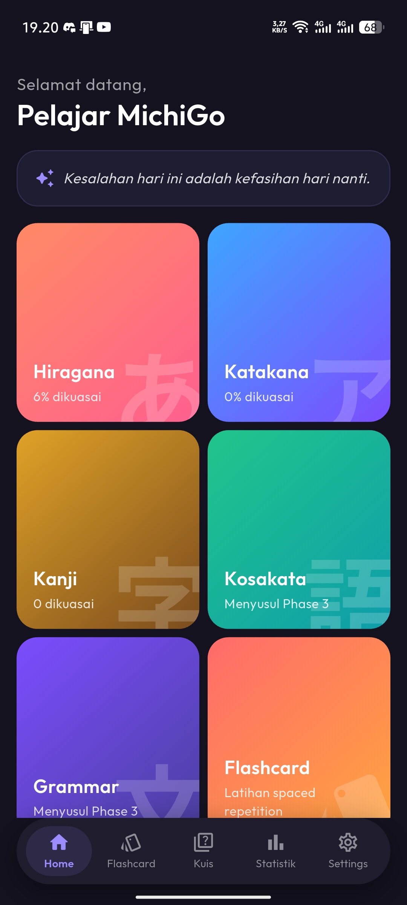
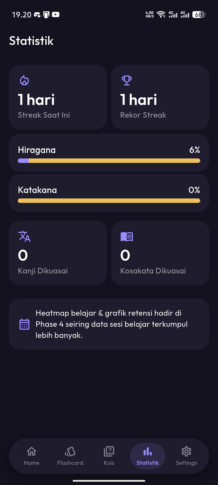
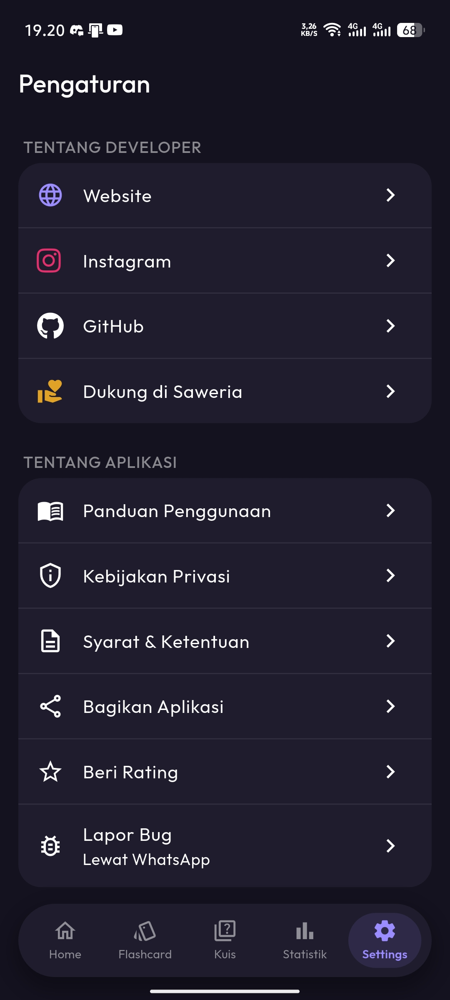

<div align="center">


[](https://github.com/Xzeel/michigo/blob/main/LICENSE)
[](https://github.com/Xzeel/michigo/issues)
[](https://github.com/Xzeel/michigo/releases)
[](https://github.com/Xzeel/michigo)

[](https://github.com/Xzeel/michigo/releases)

Japanese Language Learning App: Levels N5–N1. 🌸📚

</div>

---


<p align="center">
  
  
  
</p>

---


```
MichiGo is licensed under an Apache-2.0 License.
© 2026 XzeelArcadia.
© 2026 MichiGo. All Rights Reserved.
© 2025-2026 Lumistra. All Rights Reserved.
```
